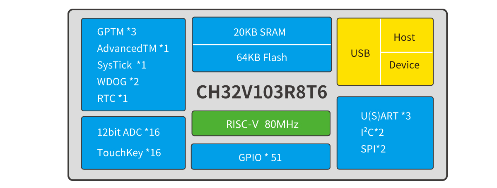

# 32位通用增强型RISC-V单片机CH32V103

[EN](README.md) | 中文

### 概述

CH32V103系列是以RISC-V3A处理器为核心的32位通用微控制器，该处理器是基于RISC-V开源指令集设计。片上集成了时钟安全机制、多级电源管理、通用DMA控制器。此系列具有1路USB2.0主机/设备接口、多通道12位ADC转换模块、多通道TouchKey、多组定时器、多路IIC/USART/SPI接口等丰富的外设资源。

### 系统框图

### 产品特点

- RISC-V3A处理器，最高80MHz系统主频；
- 支持单周期乘法和硬件除法；
- 20KB SRAM，64KB CodeFlash；
- 供电范围：2.7V ~ 5.5V，GPIO同步供电电压；
- 多种低功耗模式：睡眠/停止/待机；
- 上电/断电复位（POR/PDR）；
- 可编程电压监测器（PVD）；
- 7通道DMA控制器；
- 16路TouchKey通道监测；
- 16路12位ADC转换通道；
- 7个定时器；
- 1个USB2.0主机/设备接口（全速和低速）；
- 2个IIC接口（支持SMBus/PMBus）；
- 3个USART接口；
- 2个SPI接口（支持Master和Slave模式）；
- 51个I/O口，所有的I/O口都可以映射到16个外部中断；
- CRC计算单元，96位芯片唯一ID；
- 串行单线调试（SWD）接口；
- 封装形式：LQFP64M、LQFP48、QFN48。
